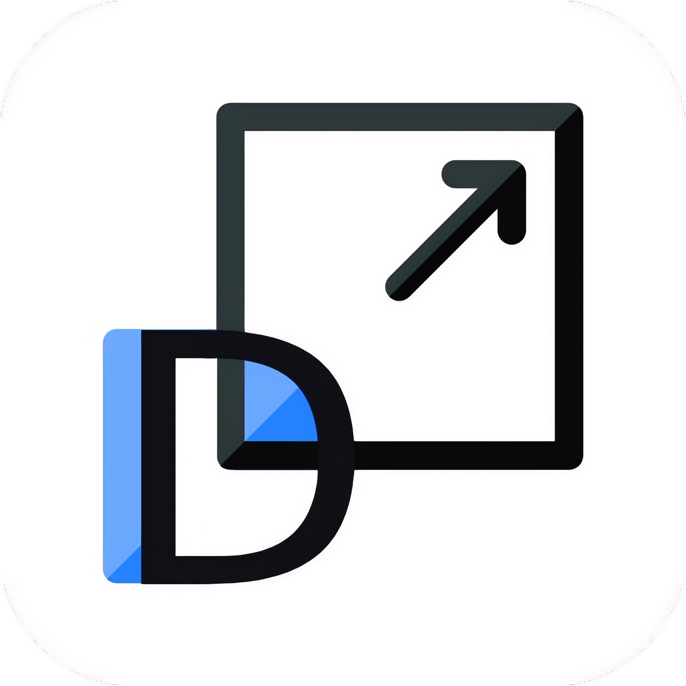
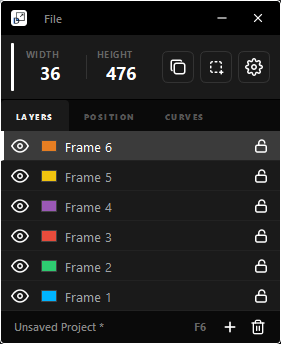

<div align="center">
  

  # Dimensio 📐
  ### High-Precision Interface Analysis & Blueprint Engineering
  
  [](https://opensource.org/licenses/MIT)
  [](https://www.python.org/downloads/)
  [](https://www.qt.io/qt-for-python)
  [](https://www.microsoft.com/windows/)

  **Dimensio** is a sophisticated, real-time geometric workspace that lives as a transparent layer over your desktop. Built for senior engineers and UI specialists, it provides the "Missing Link" between static design handovers and pixel-perfect production reality.
</div>

---

## 🏛️ The Architecture of Accuracy

In a digital landscape where visual discrepancies often survive the transition from Figma to code, **Dimensio** establishes a "Zero-Discrepancy" environment. It allows you to reverse-engineer any interface—from high-density IDEs to complex web applications—by drafting live geometric frames directly over the rendered pixels.

<div align="center">
  
</div>

### ⚖️ The Spatial Truth Problem
*   **The Translation Gap**: Designs in Figma often lose their "feel" during implementation. Dimensio reveals exactly why by measuring the rendered reality.
*   **The "DevTools Outside the Browser" Problem**: Standard Chrome/Firefox DevTools are confined to the browser DOM. They cannot measure desktop apps (like Spotify, VS Code, or Slack), cross-window spacing, or native system elements. Dimensio is a **Universal Overlay** that measures everything.
*   **Vision-AI Bottleneck**: Modern LLMs (Gemini, GPT-4) require precise geometric "Truth" of a UI to generate accurate CSS. Dimensio provides the exact pixel coordinates needed for AI-assisted frontend generation.

---

## 🛠️ Performance-Driven Feature Set

### 1. Universal Drafting Engine
Draft high-precision geometric frames over any pixel.
*   **Velocity Scaling**: Use the **Mouse Wheel** for pointer-anchored rapid resizing.
*   **Sub-Pixel Precision**: Master your layout with 1px nudges or 10px jump-shifts.
*   **Multi-Layer Persistence**: Manage complex layouts with color-coded classification and the proprietary **`.dio`** project format.

<div align="center">
  
</div>
<br/>
<div align="center">
  
</div>
<br/>
<div align="center">
  
</div>
<br/>

### 2. High-Fidelity Blueprinting
One of Dimensio's most powerful assets is the **Blueprint Wireframe** exporter.
*   **AI Context Loading**: Feed a clean, high-contrast blueprint into an LLM to generate precise layout code (Flex/Grid) in seconds.
*   **Documentation Excellence**: Create professional, schema-ready technical documentation without the visual noise of the underlying application.

<div align="center">
  
</div>

### 3. Studio-Grade Controls
*   **Smart Alignment**: Figma-style guides that snap to parallel edges and center-points for perfect symmetrical drafting.
*   **Dynamic Distancing (The Alt-Gap Logic)**: Hold the `Alt` key to trigger real-time spatial metrics.
    *   **The Use Case**: Measure the exact "Gutter" or "Padding" between a Sidebar and a Main Content frame in one click. It removes the manual math of subtracting X/Y coordinates.
*   **Independent Corner Radii**: Match modern design systems with per-corner curve controls (Square to Circle).

<div align="center">
  
</div>
<br/>
<div align="center">
  
</div>
<br/>

<div align="center">
  
</div>
<br/>
<div align="center">
  
</div>

---

## 🔄 Engineered Workflow: From Vision to Code
Dimensio is more than a tool; it's a methodology for surgical UI replication. Follow this professional 5-step sequence to bridge the gap between any visual reference and your codebase:
1.  **SNAP**: Drag a new frame over a target component (web button, sidebar, etc.).
2.  **REFINE**: Use the Mouse Wheel to bind the frame to the rendered visual boundaries.
3.  **AUDIT**: Hold `Alt` to verify the spatial relationship (paddings/gutters) between your frames and the existing layout.
4.  **SYNC**: Use `F2` to name the layer and assign a semantic color for project-level clarity.
5.  **REPLICATE**: Export the **Blueprint** and prompt your AI agent for precise, geometry-backed code generation.

<div align="center">
  
</div>
<br/>
<div align="center">
  
</div>

---

## 💡 Real-World Use Cases
Value-driven applications for Dimensio in a professional workflow:
*   **Reverse-Engineering**: Extract exact pixel spacing from production sites to build high-fidelity clones.
*   **Design Tokens**: Identify consistent spacing (paddings/margins) across multiple pages of a desktop application.
*   **AI Code Generation**: Feed geometric blueprints into LLMs to generate React/Tailwind code with zero visual drift.
*   **UI Audits**: Rapidly document layout regressions or design-system violations for QA reports.
*   **Motion Spec**: Establish start/end coordinates for complex UI animations over video players or dynamic content.

---

## 🚦 Deployment & Configuration

### 1. System Requirements
- Python 3.11+
- Windows OS (Optimized for high-performance desktop compositing)

### 2. Environment Setup
It is recommended to use a virtual environment to maintain dependency isolation:
```bash
# Initialize Environment
python -m venv venv
source venv/Scripts/activate  # Windows

# Install Dependencies
pip install -r requirements.txt

# Launch Studio
python main.py
```

---

## ⌨️ Professional Shortcut Registry

| Command | Action |
| :--- | :--- |
| `Ctrl + Shift + N` | **Initialize Workspace**: Silent autosave and fresh canvas |
| `Ctrl + S` | **Atomic Save**: Sync state to active `.dio` project |
| `Ctrl + J` | **Smart Duplicate**: Clone frame with automated offset |
| `Alt` (Hold) | **Pro Metrics**: Reveal real-time spatial distance |
| `F2` / `Del` | **Management**: Rapid rename or atomic removal |

---

## 🏗️ The Technical Core

Dimensio is engineered with a modular, event-driven architecture designed for low-latency visual feedback:

*   **Signal-Centric Design**: Built on **PySide6 (Qt for Python)**, utilizing high-performance signals and slots to synchronize the Sidebar, Overlays, and specialized logic layers without UI threading bottlenecks.
*   **State Persistence**: The core **`FrameManager`** orchestrates real-time serialization via the `.dio` binary-compatible format, ensuring atomic saves and consistent project integrity across sessions.
*   **Performance Compositing**: Employs advanced Windows desktop composition flags (`Qt.FramelessWindowHint`, `Qt.WA_TranslucentBackground`) to achieve the signature transparent workspace feel with hardware-accelerated rendering.

---

## 🔒 Security & Data Integrity

### 🗂️ The `.dio` Project Format
Dimensio uses a proprietary JSON-based schema for maximum compatibility and recovery:
- **Geometry Core**: Precise `x, y, width, height` mapping.
- **Styling Specs**: Per-corner radii and color metadata classification.
- **State Logic**: Detailed tracking of Frame Lock and Visibility status.
- **Version Control**: Built-in app and file versioning to ensure forward/backward compatibility.

### 🛡️ Data Safety Layers
- **Atomic Serialization**: Saves are performed as single-pass operations to prevent partial data writes.
- **Validation Engine**: Robust JSON schema validation on every import to prevent crashes from corrupted files.
- **Silent Recovery**: Graceful handling of legacy project files with automatic migration to the latest feature set.

---

## 🗺️ Engineering Roadmap
- [x] High-Precision Multi-Frame Geometric Engine
- [x] Figma-style Virtual Smart Alignment
- [x] `.dio` Project Persistence Specification
- [x] Per-Corner Radius Interpolation (Square to Circle)
- [ ] **Phase 2**: Multi-Point Polygon Framing & Pathing
- [ ] **Phase 2**: Automated CSS Layout Logic Export (Flex/Grid)
- [ ] **Phase 3**: System-wide Desktop Color-Space Extraction

---

## 📜 License & Contributions

- **License**: This project is licensed under the **MIT License**.
- **Contributions**: Contributions are welcome. Please ensure that new features follow the established **Signal-based architectural pattern** and maintain high-performance rendering standards.

---

<div align="center">
  <i>"Geometry is the language of the modern interface."</i>
  <br/><br/>
  Developed by **Abdulkarim Shaikh**
</div>
